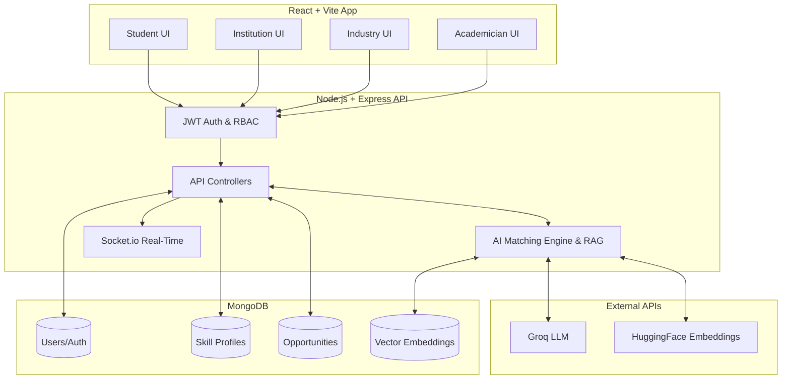

# 🎓 Sync-Skill: Bridging the Academic–Industry Skill Gap (SIH)


A unified, four-sided marketplace, AI-driven matching engine, and analytics platform designed to solve the massive disconnect between what universities teach and what the industry actually needs. Built for the **Smart India Hackathon (SIH)**.

---

## 📖 The Problem & Our Solution
**The Problem:** The persistent skill gap between academic curricula and industry requirements leaves students unemployable and recruiters struggling to find job-ready talent. Institutions lack real-time visibility into shifting industry demands.
**The Solution:** This platform provides actionable skill gap analytics, verifiable credentials, AI-driven candidate matching (using RAG), and seamless recruitment pipelines for **Students**, **Institutions**, **Academicians**, and **Industry Partners**.

---

## 🌟 Core Features by Portal

### 👨‍🎓 1. Student Portal (Empowerment & Growth)
* **AI-Powered Skill Gap Analysis:** Mathematically and semantically compares a student's current skill profile against real-time industry job postings using dynamic Radar and Bar charts.
* **Cryptographic Skill Passport:** A verifiable, fraud-proof digital wallet of skills, certifications, and academic achievements.
* **Opportunity & Assessment Hub:** Discover personalized internships/jobs and take automated skill assessments to validate proficiencies.
* **Community & Workspace:** Real-time chat and collaborative workspaces for peer learning and project building.

### 🏛️ 2. Institution Portal (Analytics & Strategy)
* **Real-time Placement Dashboard:** Tracks placement rates, average readiness scores, and active applications across the university.
* **Departmental Skill Heatmap:** Visualizes skill proficiencies (e.g., Python, React, NLP) across different majors to proactively update curriculum.
* **Partner Analytics:** Monitor which industry partners are actively hiring and what skills they prioritize.

### 🏢 3. Industry Portal (Recruitment & AI Matching)
* **RAG-Based Algorithmic Matching:** Automatically calculates Match Scores based on contextual job requirements vs. student skill profiles using Groq and HuggingFace embeddings.
* **Skill Verification Engine:** Recruiters can review submitted evidence (e.g., GitHub repos) and officially "Verify" them, locking the credential on the student's passport.
* **Recruitment Pipeline Kanban:** Manage the end-to-end hiring process, from Application to Assessment to Offer.

### 🧑‍🏫 4. Academician Portal (Mentorship & Validation)
* **Student Mentorship:** Professors track the skill progression and placement readiness of specific cohorts.
* **Academic Verification:** Faculty verify academic projects and coursework, lending institutional credibility to a student's Skill Passport.

---

## 🧠 AI & Machine Learning Capabilities
We leverage a robust AI micro-architecture in the backend to provide intelligent features:
* **Retrieval-Augmented Generation (RAG):** Context-aware skill matching and recommendations.
* **LLM Integration (Groq API):** Fast, accurate parsing of resumes, extracting technical skills, and generating natural language insights for students on how to bridge their gaps.
* **Embeddings (HuggingFace):** Semantic matching of a student's project descriptions with industry job descriptions, moving beyond simple keyword matching.

---

## 🏗️ System Architecture

The platform uses a decoupled MERN stack architecture with a highly secure Role-Based Access Control (RBAC) middleware, Real-Time Socket layers, and AI Pipelines.



---

## ⚙️ Tech Stack & Libraries

### Frontend
* **Core:** React 19, TypeScript, Vite
* **Styling & UI:** Tailwind CSS v4, Framer Motion (Animations), Lucide React (Icons)
* **Routing:** React Router v7

### Backend
* **Core:** Node.js, Express.js (v5)
* **Database:** MongoDB & Mongoose v9
* **AI & Machine Learning:** Groq SDK, HuggingFace Inference, pdf-parse
* **Real-time & Security:** Socket.io, JWT, bcryptjs, Helmet, Express-Rate-Limit, Zod (Validation)
* **Uploads:** Multer

---

## 📂 Project Structure

```text
abcd/
├── backend/                  # Node.js + Express + AI Backend
│   ├── src/
│   │   ├── ai/               # RAG, LLM clients, Embeddings
│   │   ├── config/           # DB & Environment configurations
│   │   ├── controllers/      # Route handlers
│   │   ├── middlewares/      # RBAC, Auth, Rate-limiting
│   │   ├── models/           # Mongoose schemas
│   │   ├── routes/           # 15+ Modular route files
│   │   ├── services/         # Business logic
│   │   ├── utils/            # Helpers
│   │   ├── validators/       # Zod schemas
│   │   ├── server.js         # Entry point
│   │   └── socket.js         # Real-time WebSockets
│   ├── package.json
│   └── .env.example
└── frontend/                 # React 19 + Vite + Tailwind 4 Frontend
    ├── src/
    │   ├── components/       # Reusable UI components
    │   ├── data/             # Static/Mock data
    │   ├── layouts/          # Dashboard & Page layouts
    │   ├── lib/              # Utility functions
    │   ├── pages/            # View components for routes
    │   ├── App.tsx           # Main Router
    │   └── main.tsx          # React DOM render
    ├── index.css             # Tailwind Directives
    ├── package.json
    └── vite.config.ts
```

---

## 🌐 API Endpoints (Snapshot)
The platform exposes modular RESTful APIs grouped by feature:
* `/api/auth` - Login, Registration, JWT generation
* `/api/student` - Profile management, portfolio updates
* `/api/industry` - Job postings, candidate search
* `/api/institution` - Analytics, cohort management
* `/api/matching` - **AI-powered** job-student matching algorithms
* `/api/verification` - Cryptographic skill endorsement flow
* `/api/messaging` & `/api/community` - Chat and forums
* `/api/assessment` & `/api/challenge` - Skill testing

---

## 💻 Local Setup & Installation

### Prerequisites
* Node.js (v18+)
* MongoDB (Local instance or MongoDB Atlas cluster)
* Groq API Key & HuggingFace API Token (for AI features)

### 1. Clone the repository
```bash
git clone https://github.com/shahidansari311/abcd.git
cd abcd
```

### 2. Backend Setup
```bash
cd backend
npm install
```
Create a `.env` file in the `/backend` directory:
```env
PORT=5000
MONGODB_URI=mongodb://127.0.0.1:27017/hackathon_db
JWT_SECRET=your_super_secret_jwt_key
GROQ_API_KEY=your_groq_api_key_here
HF_TOKEN=your_huggingface_token_here
```
Start the backend server:
```bash
npm run dev
```

### 3. Frontend Setup
Open a new terminal window:
```bash
cd frontend
npm install
```
Create a `.env` file in the `/frontend` directory:
```env
VITE_API_URL=http://localhost:5000/api
```
Start the frontend development server:
```bash
npm run dev
```

---

## 🚀 Future Roadmap
* **Blockchain Integration:** Migrate the Skill Passport to a public ledger (e.g., Polygon/Ethereum) for true decentralization.
* **Advanced ATS Integration:** Provide an API for recruiters to sync candidates directly into Workday/Lever.
* **Alumni Network Module:** Connect successful graduates back to their institutions for mentorship.

---
Made with ❤️ for Smart India Hackathon.
