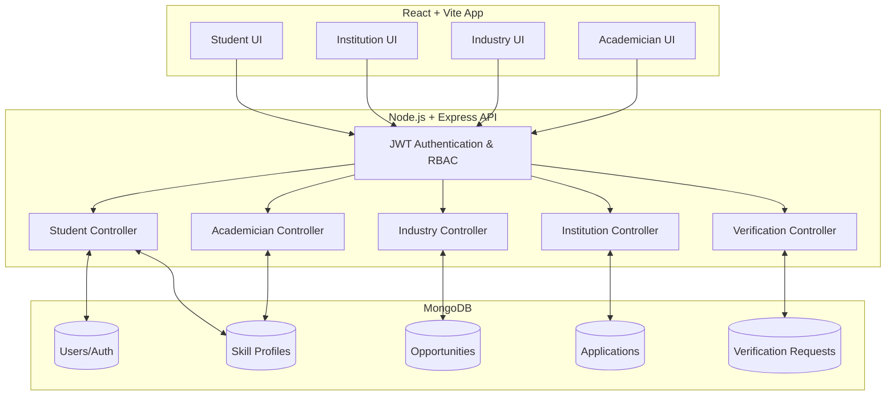
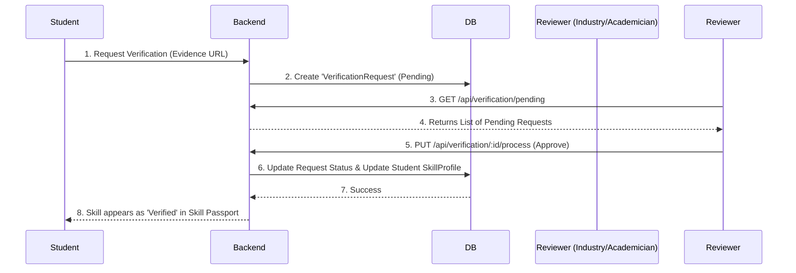

# 🎓 Bridging the Gap: Academic–Industry Skill Ecosystem


A unified, four-sided marketplace and analytics platform designed to solve the massive disconnect between academic curricula and real-world industry requirements. Built for the **Smart India Hackathon (SIH)**, this platform provides actionable skill gap analytics, verifiable credentials, and seamless recruitment pipelines for **Students**, **Institutions**, **Academicians**, and **Industry Partners**.

---

## 🛑 The Problem Statement (SIH Context)

Currently, the higher education sector and the recruitment industry face a massive "Employability Gap":
1. **Students** are unaware of exactly what skills are required for their target jobs until they start interviewing. Their resumes often lack verified credibility, and self-reported skills are frequently inaccurate.
2. **Institutions (Universities)** lack real-time, data-driven insights into how their current curriculum aligns with changing market demands. They do not know *where* their students are failing in the hiring pipeline.
3. **Industry Partners (Companies)** waste immense resources (time and capital) filtering through candidates with unverified skills and mismatched profiles, leading to high attrition rates and costly training periods.

## 💡 The Proposed Solution & Value Proposition

We built a **Centralized Data-Driven Ecosystem** that mathematically aligns student skills with industry needs.
* **For Students:** The platform dynamically parses industry job descriptions to create "Target Profiles." It calculates exact "Skill Gaps" and visually guides their learning path.
* **For Trust:** It allows Universities and Academicians to securely verify a student's technical skills and coursework, creating a fraud-proof **Skill Passport**.
* **For Institutions:** It aggregates thousands of student and placement data points to render real-time heatmaps, exposing curriculum weaknesses.
* **For Industry:** It provides an end-to-end recruitment Kanban board to hire mathematically matched candidates, reducing time-to-hire by an estimated 60%.

---

## 🌟 Detailed Features by Portal

### 👨‍🎓 1. Student Portal (Empowerment & Growth)
* **Interactive Skill Gap Analysis:** The system pulls requirements from active industry job postings. It mathematically compares the student's current `SkillProfile` against these requirements, generating a dynamic **Radar Chart** and a **Bar Chart** of specific skill point deficits.
* **Cryptographic Skill Passport:** A verifiable, fraud-proof digital wallet of credentials. Each skill has an attached evidence URL (like a GitHub repo, research paper, or certificate) that must be approved by an Academician or Industry Partner before it receives a coveted "Verified" badge.
* **Opportunity Hub:** A smart job board that filters internships and entry-level roles based on the student's calculated Match Score, ensuring they only apply to roles they are actually qualified for.

### 🏛️ 2. Institution Portal (Analytics & Strategy)
* **Real-time Placement Dashboard:** Tracks placement rates, average readiness scores, and active applications. All metrics are calculated live using complex MongoDB Aggregation Pipelines across thousands of student records.
* **Departmental Skill Heatmap:** Visualizes skill proficiencies (e.g., Python, React, NLP, AutoCAD) across different majors (CS, IT, Mech). This allows the Deans and Head of Departments to identify exactly where the curriculum needs immediate updating.
* **Partner Analytics & Placement Funnel:** Monitor which industry partners are hiring the most students, and track the exact conversion rates from "Applied" ➔ "Interviewing" ➔ "Hired".

### 🏢 3. Industry Portal (Recruitment & Verification)
* **Algorithmic Candidate Matching:** Automatically calculates Match Scores (0-100%) based on specific job requirements vs. student skill profiles using weighted algorithms.
* **Skill Verification Engine:** Recruiters can review submitted evidence during or after an interview and officially "Verify" or "Reject" them. This cross-pollinates trust across the entire ecosystem—if Google verifies a student's Python skill, other employers can trust it.
* **Recruitment Pipeline Kanban:** A drag-and-drop interface to manage the end-to-end hiring process, giving recruiters a bird's-eye view of their talent pool.

### 🧑‍🏫 4. Academician Portal (Mentorship & Research)
* **Student Mentorship:** Professors and faculty can track the skill progression, test scores, and placement readiness of their specific cohort of students.
* **Academic Verification:** Faculty act as the primary trust layer at the university level, reviewing and verifying academic projects, lab work, and technical skills, lending institutional credibility to a student's Skill Passport.
* **Research & Grants Tracking:** A specialized dashboard to monitor academic publications, research opportunities, and government grant funding statuses.

---

## 🏗️ System Architecture & Data Flow

The platform uses a decoupled MERN stack architecture with a highly secure Role-Based Access Control (RBAC) middleware ensuring strict data isolation between the four user types.

### Infrastructure Diagram


### The Verification Engine (Sequence)
How a skill goes from "Claimed" to "Verified" and permanently stored in the passport:


---

## 🧠 Core Algorithms & Business Logic

### 1. Match Score Algorithm
When an industry partner posts a job, they define required skills and target scores (e.g., Python: 80, React: 70). The backend algorithm fetches the student's `SkillProfile` and calculates a weighted average match score. 
* **Formula approach:** `(Student_Skill_Score / Required_Skill_Score) * Skill_Weight`. Cap at 100% per skill, then average across all required skills. This ensures a student cannot artificially inflate their score by having a 200% proficiency in an irrelevant skill.

### 2. Skill Gap Radar Generation
The frontend utilizes Framer Motion and custom SVG pathing logic to map the student's current proficiency vector against the target role's proficiency vector on a radial axis. This provides an instant, cognitive visualization of where the student falls short compared to industry standards.

---

## 🔐 Security & Compliance

Given that this platform handles sensitive student data and institutional metrics, security is paramount:
* **JWT Authentication:** Stateless, signed JSON Web Tokens ensure secure sessions without backend memory overhead.
* **Role-Based Access Control (RBAC):** Custom middleware intercepts every API request. A Student cannot access an Institution's heatmap; an Industry partner cannot view a Student's unverified draft profile.
* **Password Hashing:** Bcrypt encryption with high salt rounds for all user credentials.
* **NoSQL Injection Prevention:** Mongoose ODM strictly enforces schema types, preventing arbitrary data injection.

---

## 📊 Database Schema Highlights

The MongoDB database is fully normalized to ensure fast aggregations:
1. **User Model:** Base model handling auth, extended by `Student`, `Institution`, `Academician`, and `Industry` via polymorphic relationships or role flags.
2. **SkillProfile Model:** Contains arrays of skills `[{ name: 'Python', score: 85, isVerified: true, evidenceUrl: '...' }]`.
3. **Opportunity Model:** Job postings containing arrays of required skills `[{ name: 'Python', requiredScore: 80 }]`.
4. **Application Model:** The junction table tracking the status of a Student applying to an Opportunity (e.g., Applied ➔ Interviewing ➔ Hired).
5. **VerificationRequest Model:** Tracks pending verifications, pointing to a specific skill inside a student's profile and logging the reviewer's ID.

---

## 🎨 UI/UX Design Principles

The frontend was designed with a focus on modern, enterprise-grade aesthetics to wow users and investors alike:
* **Glassmorphism & Gradients:** Soft, modern gradients (Primary: `#2E6F40`, Accent: `#68BA7F`) convey a sense of growth and premium luxury.
* **Micro-interactions:** Every button hover, chart load, and page transition uses `framer-motion` to feel alive and responsive.
* **Data Density vs. Clarity:** Dashboards use whitespace and standard geometric charts (Radars, Heatmaps) so users aren't overwhelmed by tables of raw data.

---

## 📂 Project Directory Structure

```text
abcd/
├── backend/                  # Node.js / Express server
│   ├── src/
│   │   ├── controllers/      # Business logic for all 4 portals
│   │   ├── middleware/       # JWT Auth & Role-Based Access Control
│   │   ├── models/           # Mongoose schemas (Student, Application, etc.)
│   │   ├── routes/           # Express API endpoints
│   │   └── services/         # Database interaction layers
│   └── package.json
└── frontend/                 # React / Vite application
    ├── src/
    │   ├── components/       # Reusable UI (Cards, Badges, SVG Charts)
    │   ├── lib/              # API interceptors and global utilities
    │   └── pages/
    │       ├── auth/         # Multi-role Login/Signup flows
    │       ├── industry/     # Kanban pipeline, Candidate matching
    │       ├── institution/  # Heatmaps, Dashboard analytics
    │       └── student/      # Skill gaps, Passports, Dashboards
    └── package.json
```

---

## ⚙️ Tech Stack Breakdown

* **Frontend:** React 18, TypeScript, Vite (for ultra-fast HMR and building), Tailwind CSS (Utility-first styling system), Framer Motion (for fluid, modern animations), Lucide Icons, Custom SVG D3-style Charts.
* **Backend:** Node.js, Express.js, JSON Web Tokens (JWT) for stateless authentication, Bcrypt for security.
* **Database:** MongoDB (Aggregations extensively used for dashboard math) with Mongoose ODM.
* **Deployment (Planned):** Vercel (Frontend), AWS EC2 / Render (Backend), MongoDB Atlas (Database).

---

## 💻 Local Setup & Installation

### Prerequisites
* Node.js (v18+)
* MongoDB (Local instance or Atlas cluster)

### 1. Clone the repository
```bash
git clone https://github.com/shahidansari311/abcd.git
cd abcd
```

### 2. Backend Setup
```bash
cd backend
npm install
```
Create a `.env` file in the `/backend` directory:
```env
PORT=5000
MONGODB_URI=mongodb://127.0.0.1:27017/hackathon_db
JWT_SECRET=your_super_secret_jwt_key
```
Start the backend server:
```bash
npm run dev
```

### 3. Frontend Setup
Open a new terminal window:
```bash
cd frontend
npm install
```
Create a `.env` file in the `/frontend` directory:
```env
VITE_API_URL=http://localhost:5000/api
```
Start the frontend development server:
```bash
npm run dev
```

---

## 📈 Business Model (SIH Pitch)
If scaling this into a startup, the revenue streams would include:
1. **B2B SaaS for Institutions:** Universities pay an annual subscription for access to the analytics dashboard, heatmap generation, and automated accreditation reporting.
2. **B2B Freemium for Industry:** Basic job postings are free, but companies pay per successful hire or pay a premium subscription for advanced algorithmic sourcing and access to the verified candidate pool.
3. **Free for Students:** Ensuring massive user adoption and creating an unignorable talent pool.

---

## 🚀 Future Scope
* **AI Resume Parsing:** Integrate Gemini/OpenAI to auto-generate a student's base `SkillProfile` directly from their uploaded PDF resume.
* **Gov Job API Integration:** Connect to the National Career Service (NCS) API to automatically populate the Opportunity Hub with government internships.
* **Blockchain Passports:** Move the Skill Passport data structure to a Polygon or Ethereum smart contract to make it completely decentralized, portable, and tamper-proof across the internet.
* **Automated Intervention Engine:** AI triggers automatic email alerts to faculty if a cohort's skills begin trending downwards compared to industry averages.
