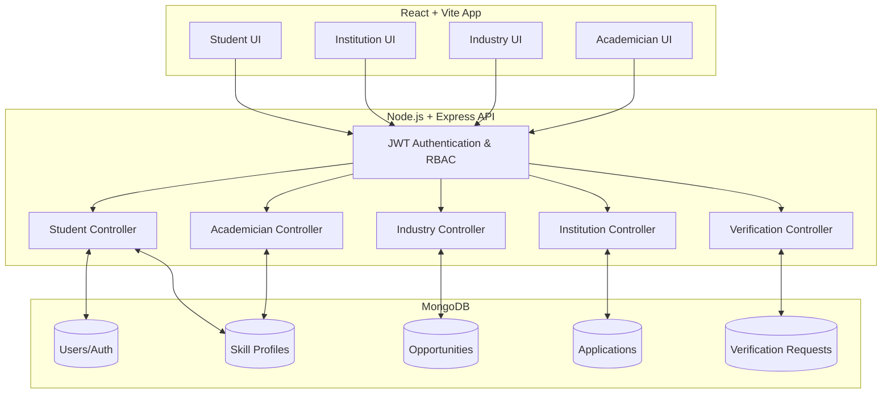
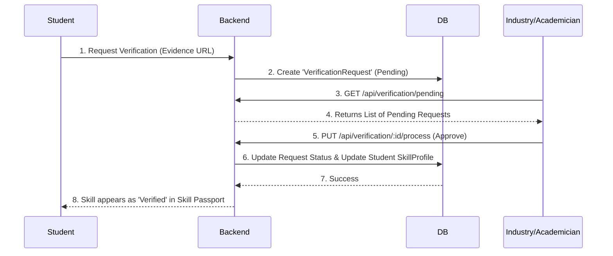

# 🎓 Bridging the Gap: Academic–Industry Skill Ecosystem


A unified, four-sided marketplace and analytics platform designed to solve the massive disconnect between what universities teach and what the industry actually needs. This platform provides actionable skill gap analytics, verifiable credentials, and seamless recruitment pipelines for **Students**, **Institutions**, **Academicians**, and **Industry Partners**.

---

## 🌟 Key Features by Portal

### 👨‍🎓 1. Student Portal (Empowerment & Growth)
* **Interactive Skill Gap Analysis:** Mathematically compares a student's current skill profile against real-time industry job postings using dynamic Radar and Bar charts to highlight exact areas for improvement.
* **Cryptographic Skill Passport:** A verifiable, fraud-proof digital wallet of credentials.
* **Opportunity Hub:** Discover and apply for internships and jobs tailored to their specific skill set.

### 🏛️ 2. Institution Portal (Analytics & Strategy)
* **Real-time Placement Dashboard:** Tracks placement rates, average readiness scores, and active applications across the university.
* **Departmental Skill Heatmap:** Visualizes skill proficiencies (e.g., Python, React, NLP) across different majors to identify curriculum gaps.
* **Partner Analytics:** Monitor which industry partners are hiring the most students from the institution.

### 🏢 3. Industry Portal (Recruitment & Verification)
* **Algorithmic Candidate Matching:** Automatically calculates Match Scores based on specific job requirements vs. student skill profiles.
* **Skill Verification Engine:** Recruiters can review submitted evidence (e.g., GitHub repos, certificates) and officially "Verify" or "Reject" them, directly updating the student's Skill Passport.
* **Recruitment Pipeline Kanban:** Manage the end-to-end hiring process from Application to Offer.

### 🧑‍🏫 4. Academician Portal (Mentorship & Research)
* **Student Mentorship:** Professors and faculty can track the skill progression and placement readiness of their specific cohort of students.
* **Academic Verification:** Faculty can review and verify academic projects, coursework, and technical skills, lending institutional credibility to a student's Skill Passport.
* **Research & Grants Tracking:** A dashboard to monitor academic publications, research opportunities, and grant funding statuses.

---

## 🏗️ System Architecture

The platform uses a decoupled MERN stack architecture with a highly secure Role-Based Access Control (RBAC) middleware.



## ⚙️ Tech Stack
* **Frontend:** React 18, TypeScript, Vite, Tailwind CSS, Framer Motion, Lucide Icons, Custom SVG Charts (Radar, Heatmaps).
* **Backend:** Node.js, Express.js, JWT Authentication, Mongoose (MongoDB ODM).
* **Database:** MongoDB (Aggregations used for complex dashboard math).

---

## 🚀 Data Flow: The Verification Process

How a skill goes from "Claimed" to "Verified" across the portals:



---

## 💻 Local Setup & Installation

### Prerequisites
* Node.js (v18+)
* MongoDB (Local instance or Atlas cluster)

### 1. Clone the repository
```bash
git clone https://github.com/shahidansari311/abcd.git
cd abcd
```

### 2. Backend Setup
```bash
cd backend
npm install
```
Create a `.env` file in the `/backend` directory:
```env
PORT=5000
MONGODB_URI=mongodb://127.0.0.1:27017/hackathon_db
JWT_SECRET=your_super_secret_jwt_key
```
Start the backend server:
```bash
npm run dev
```

### 3. Frontend Setup
Open a new terminal window:
```bash
cd frontend
npm install
```
Create a `.env` file in the `/frontend` directory:
```env
VITE_API_URL=http://localhost:5000/api
```
Start the frontend development server:
```bash
npm run dev
```

---

## 🏆 Hackathon Context

This project was built for the **Smart India Hackathon (SIH)**. It tackles the critical challenge of aligning educational outcomes with real-world industry requirements by providing verifiable, data-driven tools for all stakeholders involved in the academic-to-career pipeline.
